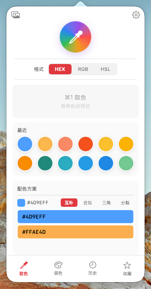
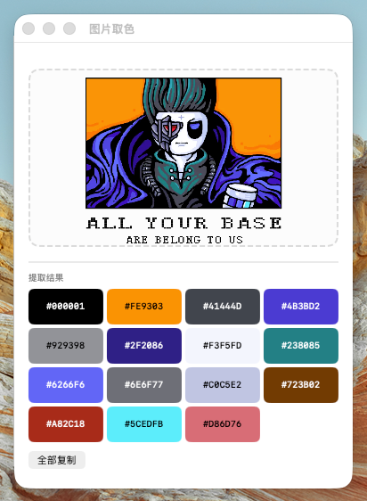
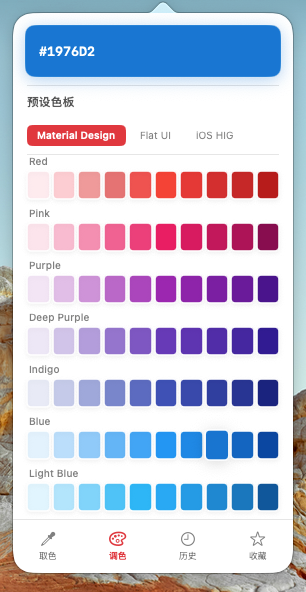
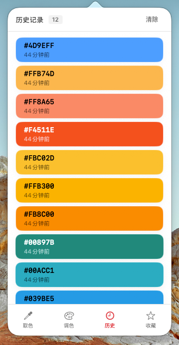
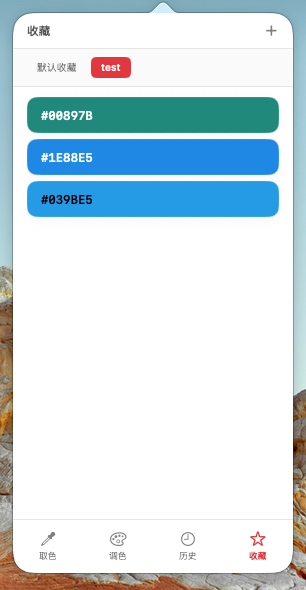

# ColorPicker

一款轻量的 macOS 屏幕取色工具，菜单栏常驻，全局快捷键取色，多格式复制，历史记录与分组收藏。

## 系统要求

- macOS 14.0 (Sonoma) 及以上
- 同时支持 Intel (x86_64) 和 Apple Silicon (arm64)

## 功能

### 屏幕取色

点击取色按钮或按快捷键 `⌘⇧C`，调用系统 NSColorSampler 从屏幕任意位置采集颜色，自动复制到剪贴板。取色时面板自动收起，完成后恢复。

### 配色方案

基于最近取色结果，自动生成 4 种配色方案（纯色轮 HSL 计算，零依赖）：

| 方案 | 算法 |
|------|------|
| 互补 | H + 180° |
| 近似 | H ± 30°，5 色调 |
| 三角 | H + 120°/240° |
| 分裂互补 | H + 150°/210° |

悬浮方案色块可在预览区实时预览，点击复制，右键添加入收藏。

### 预设色板

内置 `presets.json`，三类预设色板：

- **Material Design** — 19 组，每组 10 色
- **Flat UI** — 10 组，每组 4 色
- **iOS HIG** — 12 组，每组 5 色

分类标签横向切换，色块网格展示，点击复制，悬浮预览。

### 图片取色

独立窗口，支持拖拽图片、粘贴（⌘V）、选文件三种导入方式。K-Means++ 聚类算法提取主色调（最多 16 簇），结果网格展示，支持一键复制全部。

### 历史记录

无数量上限，按存储时长自动清理。列表视图显示颜色值 + 相对时间，点击复制，右键可收藏或删除。取色页的「最近」区域展示最近 12 个颜色圆点。

### 收藏分组

- 分组无上限，组内颜色无上限
- 横向滚动标签切换分组，默认收藏不可删除
- 右键菜单：移动颜色到其他分组、删除
- 新建/重命名通过 popover 输入

### 设置

独立窗口，4 个标签页：

| 标签 | 内容 |
|------|------|
| 通用 | 默认颜色格式（HEX/RGB/HSL）+ 主题外观（系统/浅色/深色） |
| 快捷键 | KeyboardShortcuts.Recorder 自定义取色快捷键 |
| 数据 | 历史保留策略（一周/一月/三月/无限）+ 清除历史 |
| 关于 | 应用图标、名称、版本号、退出按钮 |

## 交互

- **点击色块** → 复制当前格式颜色值
- **右键色块** → 上下文菜单（复制/添加到收藏/删除）
- **悬浮圆点** → 预览区实时显示该颜色详情
- **分组管理** → 空分组直接删除，有颜色需确认
- **历史清理** → 面板清除 + 设置清除均需确认弹窗

## 架构

```
ColorPickerApp
  ├── AppDelegate → MenuBarController (NSStatusItem + NSPopover)
  ├── KeyboardShortcuts 全局快捷键
  └── Settings Scene → SettingsView

ColorPanelView（底部 4 Tab）
  ├── 取色页：圆形按钮 + 格式分段 + 悬浮预览 + 最近圆点 + 配色方案
  ├── 调色板页：预设色板库
  ├── 历史页：色块列表
  └── 收藏页：分组标签 + 色块列表

ColorStore（单例）
  - history: [CapturedColor]
  - favoriteGroups: [FavoriteGroup]
  - defaultFormat / historyRetention
```

## 存储

所有数据通过 UserDefaults JSON 持久化：

| Key | 类型 | 默认值 |
|-----|------|--------|
| `colorHistory` | `[CapturedColor]` | `[]` |
| `favoriteGroups` | `[FavoriteGroup]` | 默认收藏 |
| `defaultFormat` | String | `"HEX"` |
| `appTheme` | String | `"system"` |
| `historyRetention` | String | `"week"` |

## 项目结构

```
color-picker/
├── Package.swift
├── Sources/
│   ├── App/
│   │   ├── ColorPickerApp.swift
│   │   └── MenuBarController.swift
│   ├── Model/
│   │   ├── CapturedColor.swift
│   │   ├── ColorFormat.swift
│   │   ├── FavoriteGroup.swift
│   │   ├── PresetPalette.swift
│   │   └── SchemeType.swift
│   ├── Services/
│   │   ├── ColorSamplerService.swift
│   │   ├── ColorStore.swift
│   │   ├── ColorPaletteService.swift
│   │   └── ThemeManager.swift
│   ├── Utilities/
│   │   └── ColorConversion.swift
│   └── Views/
│       ├── ColorPanelView.swift
│       ├── PaletteTabView.swift
│       ├── ImagePaletteWindow.swift
│       ├── HistoryWindowView.swift
│       ├── SettingsView.swift
│       └── GroupPickerPopover.swift
├── scripts/
│   └── build.sh
└── Resources/
    ├── Info.plist
    ├── presets.json
    └── Assets.xcassets/AppIcon.appiconset/
```

## 构建

```bash
# 调试构建
swift build

# 打包 Release（通用二进制 .app，arm64 + x86_64）
./scripts/build.sh
open build/ColorPicker.app
```

## 技术栈

- Swift 5.9 + SwiftUI
- AppKit 桥接（NSColorSampler、NSStatusItem、NSPopover）
- [KeyboardShortcuts](https://github.com/sindresorhus/KeyboardShortcuts) — 全局快捷键
- UserDefaults 持久化
- 无其他第三方依赖

## APP 截图




